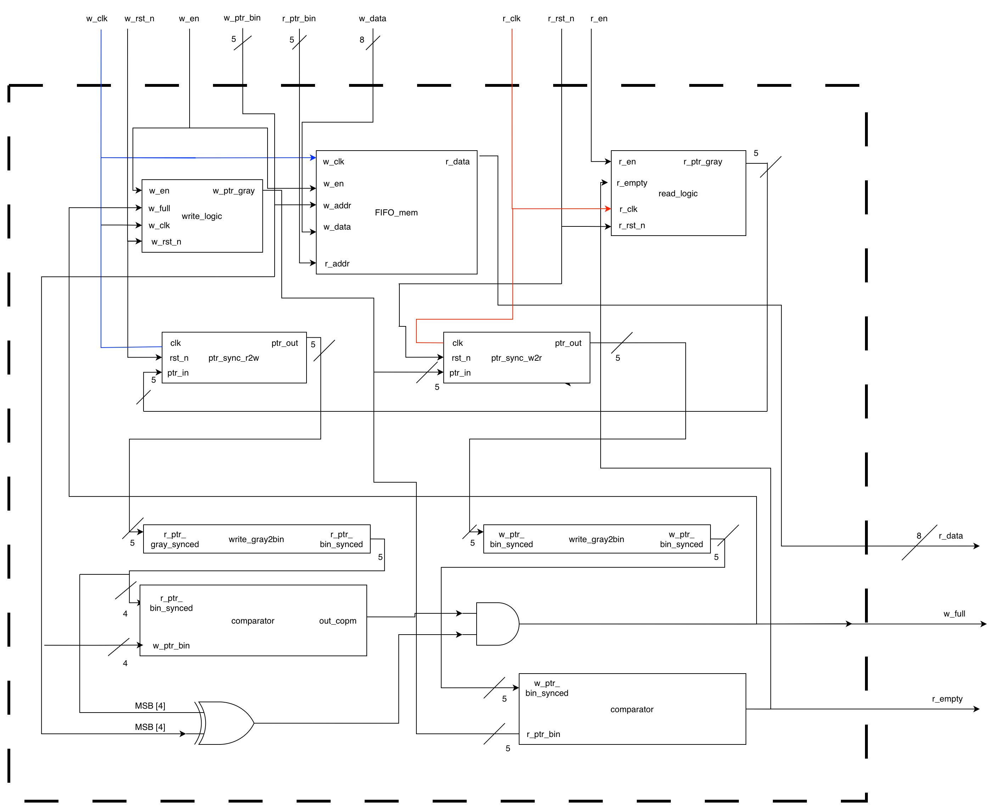
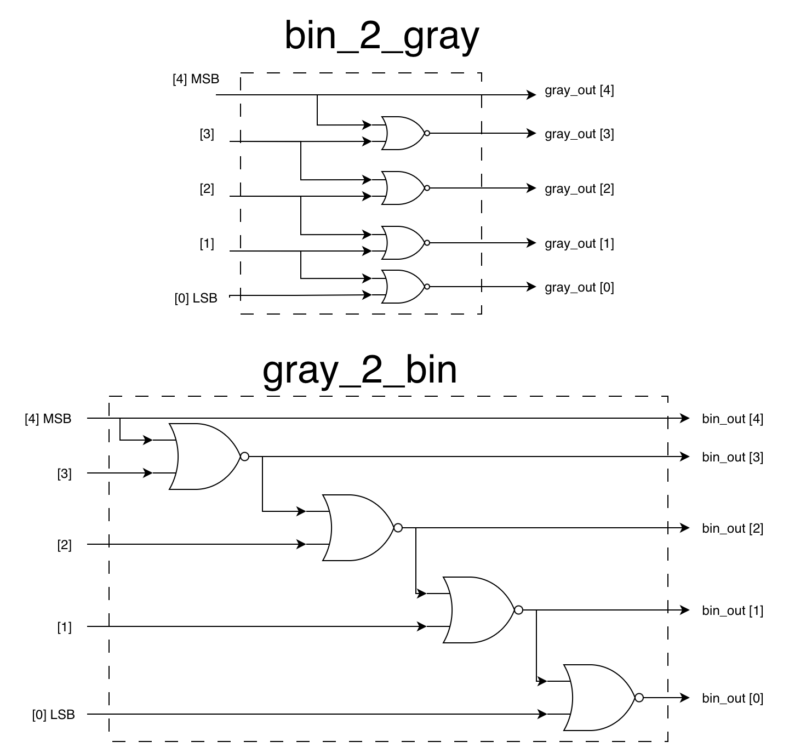
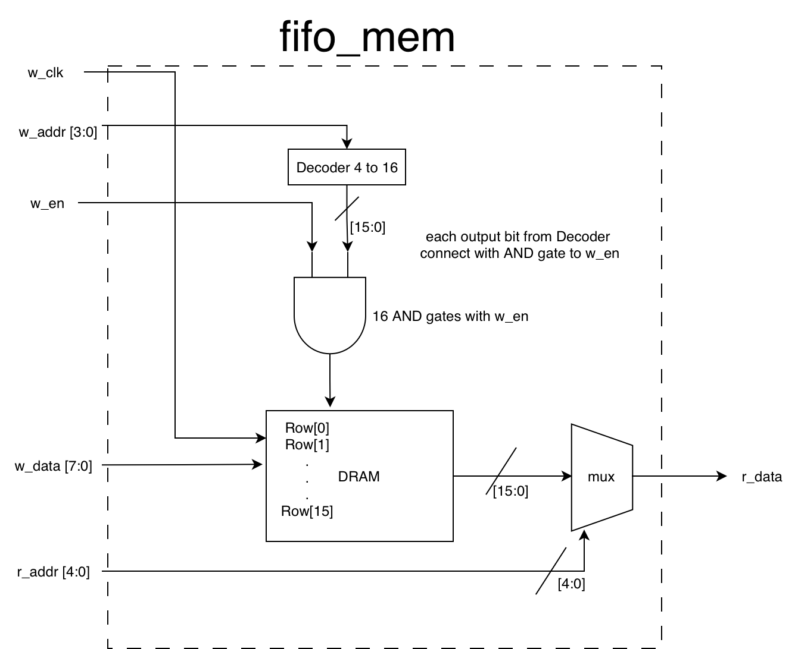
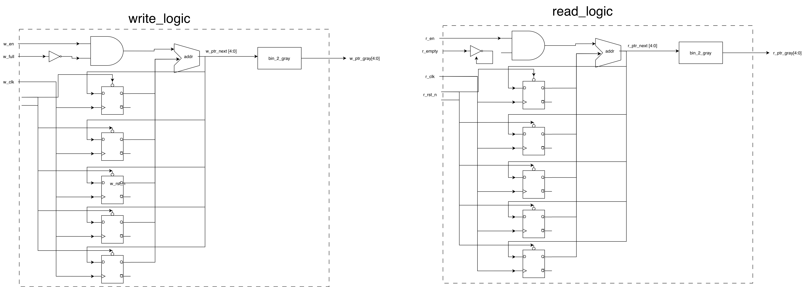
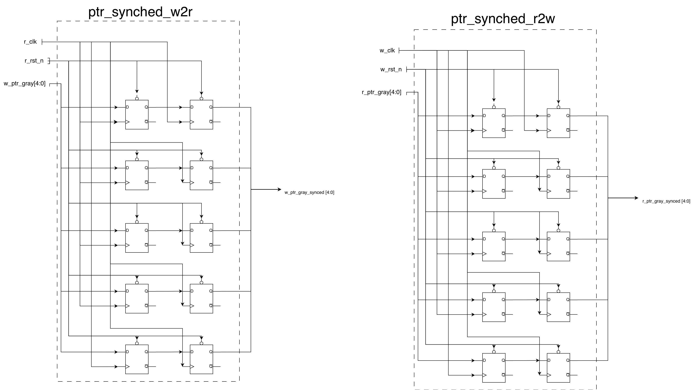
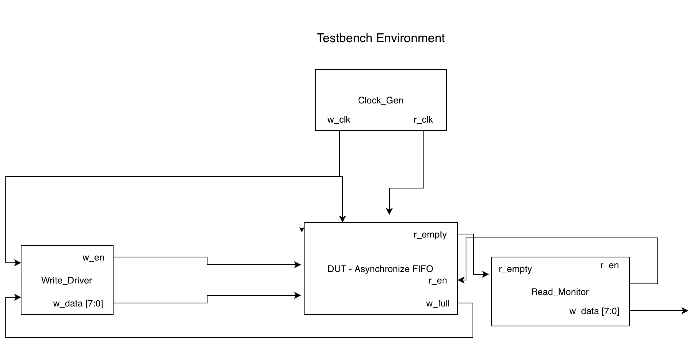

A Asynchronous FIFO implementation designed for safe Clock Domain Crossing (CDC) using Gray Code pointers. 
This project demonstrates multi-bit signal synchronization, dual-port RAM usage, and a SystemVerilog verification environment.

## 1. Top Level Interface
The module bridges two asynchronous clock domains: Write Domain (`w_clk`) and Read Domain (`r_clk`).

## 2. Micro-Architecture
The design of CDC challenges using:
* **Gray Code Counters:** To prevent multi-bit glitches during pointer sampling.
* **2-Stage Synchronizers:** To mitigate metastability.
* **Dual Port RAM:** For simultaneous read/write operations.

## 3. Verification Environment
The design was verified using a layered Testbench approach, including:
* **Stimulus Generator:** Randomizes write transactions.
* **Monitor/Checker:** Validates data integrity and Empty/Full flags.
* **Assertions:** Ensures protocol compliance.

**Author:** Elad Kroitoro  
**University:** The Hebrew University Of Jerusalem - Electrical Engineering and Applied Physics Student (3rd Year)
